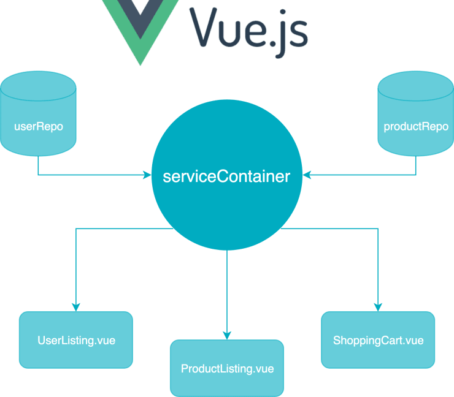

# Лабораторна робота №3. Репозиторії та сервіси

## Тема: Створення репозиторієв та сервісів

### Теоретичні відомості

Паттерн репозиторій (Repository Pattern) - це паттерн проектування, який використовується в розробці програмного забезпечення для відокремлення логіки доступу до даних від решти додатку. 
Він дозволяє абстрагувати роботу з базою даних або іншими джерелами даних, надаючи спеціалізований інтерфейс для взаємодії з цими джерелами.

*Рисунок 1. Схема паттерну репозиторій*

**Основні поняття та компоненти паттерну репозиторій:**

**Репозиторій (Repository)** - клас або інтерфейс, який надає методи для зберігання, отримання, оновлення та видалення об'єктів з бази даних або іншого джерела даних. Він приховує деталі роботи з базою даних від решти програми.

**Модель (Model)** - об'єкт, який представляє дані, що зберігаються в базі даних або іншому джерелі даних. Модель може мати відповідність (mapping) до таблиці бази даних або іншої структури даних.

**Клієнтський код (Client Code)** - решта додатку, який використовує репозиторій для взаємодії з даними. Клієнтський код викликає методи репозиторія, а не безпосередньо взаємодіє з базою даних.

Переваги використання паттерну репозиторій:

 - *Розділення відповідальностей* - паттерн репозиторій дозволяє відокремити логіку доступу до даних від бізнес-логіки програми. Це полегшує підтримку і рефакторинг.

 - *Тестованість* - оскільки клієнтський код взаємодіє з репозиторієм через інтерфейс, це дозволяє легко тестувати класи, що використовують репозиторій, за допомогою мокінгу або створення фейків.

 - *Повторне використання* - репозиторії можна використовувати в різних частинах програми і навіть в інших проектах, що сприяє повторному використанню коду.

 - *Абстракція джерел даних* - репозиторій може працювати з різними джерелами даних (наприклад, базою даних, веб-сервісами, файлами) і надавати єдиний інтерфейс для роботи з ними.

 - *Підтримка розширення* - зміна джерела даних або реалізації репозиторія може бути виконана без зміни клієнтського коду.

 - *Зниження ризику помилок* - за допомогою репозиторіїв зменшується ризик дублювання коду для доступу до даних та зменшується ймовірність помилок.

 - Паттерн є корисним у великих проектах і спрощує управління та розвиток додатків, особливо тих, що взаємодіють зі складними джерелами даних.

### Завдання

1. Виконати клонуванння та запуск проекту: https://github.com/lisnayk/modern-frameworks/tree/master/lab3-ex
2. Проаналізувати схеми даних  https://api.escuelajs.co/docs та документацю https://fakeapi.platzi.com/
3. Ознайомитися з додатковими матеріалами та проаналізувати код з пункту 1. 
4. Використовуючи існуючий код:
   - Створити шаблонні інтерфейси `Creatable`, `Editable`, `Deletable`.
   - Створити типи `Product` та `User`.
   - Створити класси `ProductService` та `UserService` що імпліментують інтерфейси типів відповідно.
   - Імпліментувати методи інтерфейсів (`Readable`, `Writable`, `Editable`, `Deletable`) для сервісів (репозиротіїв) Categories, Products та Users.
   - Оновити фабрику `ServiceProvider` та додати нові сервіси.
5. Протестувати роботу сервісів та їх методів.
6. Розмістити проект у системі контролю версій (github.com, bitbucket.org) з іменем ропозиторію mjsf-mag-lab3.
7. Відправити посилання на репозиторій у якості звіту з виконаної роботи.

### Додатковий матеріал:

1. https://markus.oberlehner.net/blog/the-ioc-container-pattern-with-vue/
2. https://medium.com/backenders-club/consuming-apis-using-the-repository-pattern-in-vue-js-e64671b27b09
3. https://itnext.io/building-vue-enterprise-application-part-3-the-store-dbda0e4bb117

### Контрольні питання

1. Що таке паттерн репозиторій і для чого він використовується в розробці програмного забезпечення?
2. Які компоненти включаються в реалізацію паттерну репозиторій?
3. Яка роль моделі в паттерні репозиторій?
4. Як паттерн репозиторій допомагає відокремити логіку доступу до даних від бізнес-логіки додатку?
5. Як паттерн репозиторій сприяє тестованості програми?
6. Які переваги надає використання паттерну репозиторій?

